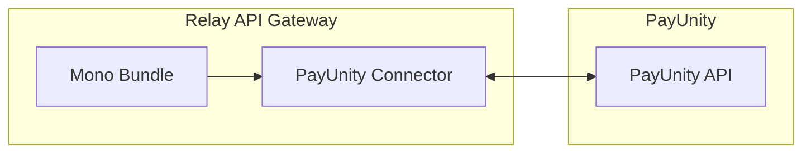

# Mono PayUnity Connector

Source: https://gitlab.tugraz.at/dbp/mono/dbp-relay-mono-connector-payunity-bundle

The PayUnity Connector connects mono with [PayUnity](https://www.payunity.com/).
It allows configuring multiple different payment contracts with PayUnity, each with
different payment methods.

## Installation Requirements

* A MySQL/MariaDB database
* (for production use) A contract with [PayUnity](https://www.payunity.com/)

## Documentation

* [Configuration](./config.md)
