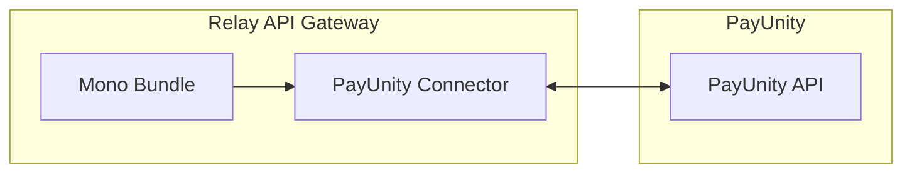

# Mono PayUnity Connector

Source: https://gitlab.tugraz.at/dbp/mono/dbp-relay-mono-connector-payunity-bundle



The PayUnity Connector connects mono with [PayUnity](https://www.payunity.com/).
It allows configuring multiple different payment contracts with PayUnity with
each different payment methods.

## Installation Requirements

* A SQL database like MySQL, PostgreSQL or similar.

## Configuration

```yaml
dbp_relay_mono_connector_payunity:
    database_url:         # Required
    payment_contracts:    # Required
        # Prototype
        -
            api_url:              ~
            entity_id:            ~
            access_token:         ~
            payment_methods_to_widgets: # Required
                # Prototype
                -
                    name:                 ~
                    widget_url:           ~
                    template:             ~
                    icon_url:             ~
                    brands:               ~
```
